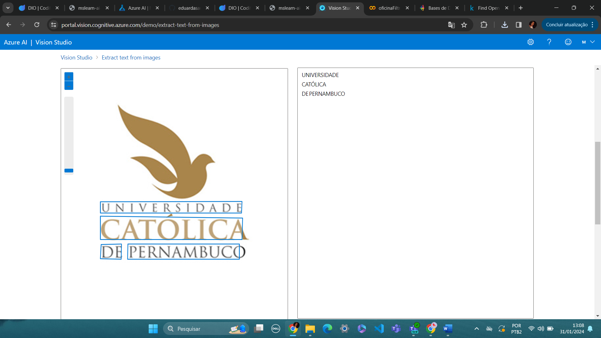
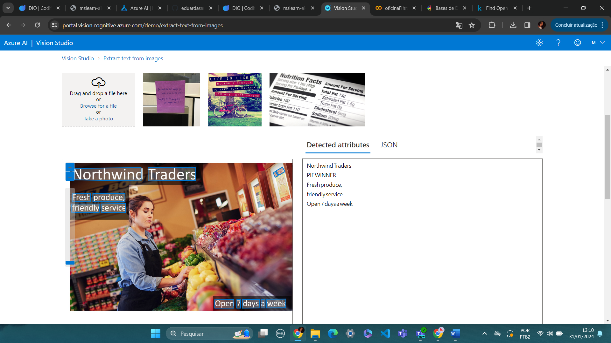

# Análise e reconhecimento para a transformação de imagens em dados

Neste módulo algumas habilidades foram trabalhadas, como a aplicação do Azure Vision Studio, para a manipulação de imagens.
Alguns exercícios trataram o reconhecimento de faces, a partir da plataforma, porém, nesse exercício foram aplicados exemplos 
para executar a transformação de imagens em dados de texto. Ou seja, identificar em imagens palavras digitalizadas ou à mão e transcrevâ-las
para dados em formato de texto. As figuras a seguir demonstram os resultados atingidos, a partir dos inputs utilizados.

## Resultado para a primeira imagem:

## Resultado para a segunda imagem:

## Resultado para a terceira imagem:

Para realizar este execício, foi preciso criar um resource na página portal.vision.cognitive.azure.com, a partir de uma conta Azure,
para executar a ferramenta de reconhecimento no Vision Studio Azure. O passo a passo para executar esta operação ocorre primeiramente, 
ao clicar na aba "Optical character recognition" se o objetivo for extrair textos de imagens. Porém, ainda no site mencionado, se o 
objetivo for atingir o reconhecimento facial, enão o direcionamento será para a aba "Face". A partir disso, foi selecionada a imagem
e realizada a operação.

